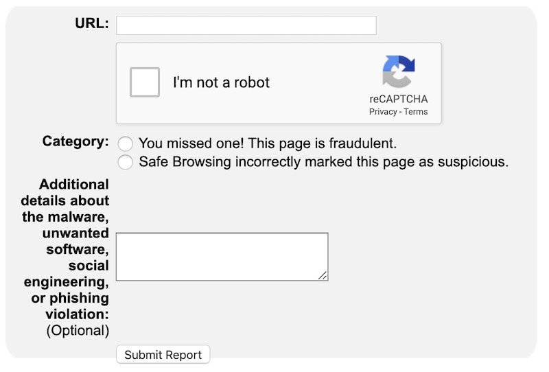
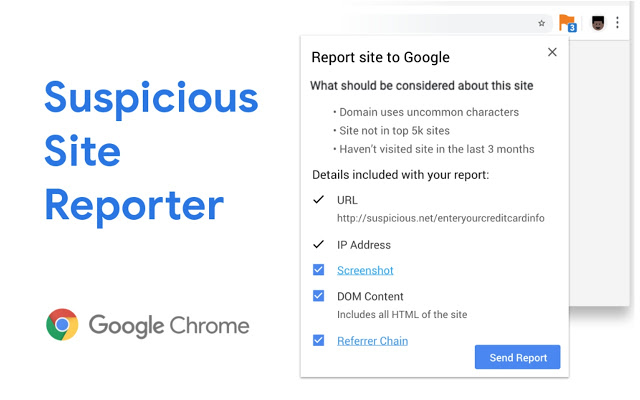

# Undocumented API for reporting to Safe Browsing

If you're tired of manually filling out this Safe Browsing report form and wish you could automate the process, this repo is for you!



### How to use the API

Send a `POST` request to `https://safebrowsing.google.com/safebrowsing/clientreport/crx-report` with the request body being a JSON array:
```json5
[
  "https://suspicious.net/page", // (required) the URL to report
  null,                          // unused field
  "UE5H.......",                 // (optional) screenshot of the malicious site as a base64 encoded PNG
  "<head><body>.......",         // (optional) the DOM of the malicious site
  null,                          // (optional) referrer chain: I've not yet worked out the format for this
  ["flag1", "flag2"],            // (optional) a set of flags for why the site was flagged as suspicious.
                                 // Valid flags are documented here: https://github.com/chromium/suspicious-site-reporter/blob/444666114ec758df1c151514cfd9e2218141da42/extension/alerts.js#L25
]
```

There's some example Go code in this repo but as long as you follow the write request format this'll work in any language.

Happy hunting! 🎣 

### Where did this API come from?
Recently I've been submitting a lot of sites to Safe Browsing and found [this](https://chrome.google.com/webstore/detail/suspicious-site-reporter/jknemblkbdhdcpllfgbfekkdciegfboi) Google official Chrome extension which somehow allowed you to submit reports without needing a captcha.



This massively sped up the reporting process but still required some manual effort to open each malicious site and click the report button. Surely I could reverse engineer the extension and find out what API it was submitting to?

A bit of network request sniffing (and later finding the extension was [open source](https://github.com/chromium/suspicious-site-reporter/blob/444666114ec758df1c151514cfd9e2218141da42/extension/client_request.proto#L21)...) and soon enough I'd found both the correct endpoint and request format to submit any site to Safe Browsing.